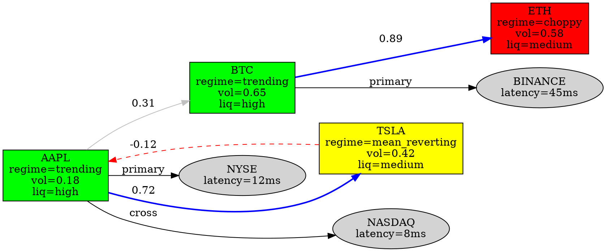

# Phase 8: Market Fabric Cypher & BAM Grid Architecture

**Cross-Agent Assessment** — Workflow Optimizer, AI Engineer, Backend Architect, Performance Benchmarker, Tool Evaluator, Test Writer Fixer, DevOps Automator, Frontend Developer, Rapid Prototyper, UX Researcher
**Status**: Phase 7.1 COMPLETE → Phase 8 ARCHITECTURE DESIGN  
**Head**: `18bf60c` — `feature/github-mcp-setup`

---

## 1. Agent Role Assignments

| Agent | Skill File | Responsibility in This Assessment |
|-------|-----------|-----------------------------------|
| **Workflow Optimizer** | `/.ai/testing/workflow-optimizer.md` | Orchestrate cross-agent handoffs, identify parallelization |
| **AI Engineer** | `/.ai/engineering/ai-engineer.md` | Design ML feature extraction from BAM grid, vector embedding strategy |
| **Backend Architect** | `/.ai/engineering/backend-architect.md` | Data layer schema, mesh topology, API contracts |
| **Performance Benchmarker** | `/.ai/testing/performance-benchmarker.md` | Latency budgets, grid traversal benchmarks, wire format targets |
| **Tool Evaluator** | `/.ai/testing/tool-evaluator.md` | SBE vs FlatBuffers vs custom, graph DB vs adjacency list |
| **Frontend Developer** | `/.ai/engineering/frontend-developer.md` | u8 rematerialization → human table view pipeline |
| **DevOps Automator** | `/.ai/engineering/devops-automator.md` | Mesh node deployment, k8s topology, Aeron/QUIC infra |
| **Rapid Prototyper** | `/.ai/engineering/rapid-prototyper.md` | 48-hour prototype of dot-cypher query engine |
| **Test Writer Fixer** | `/.ai/engineering/test-writer-fixer.md` | Property-based tests for grid invariants, cypher correctness |
| **UX Researcher** | `/.ai/design/ux-researcher.md` | Dashboard information density, trader cognitive load |

---

## 2. Core Concept: Market Fabric Dot-Cypher

**What it is**: A compressed, queryable graph representation of market topology where:
- **Nodes** = assets (stocks, crypto, FX, futures), market venues, liquidity pools
- **Edges** = correlation, cointegration, lead-lag, cross-venue arbitrage, order flow influence
- **Cypher** = Declarative pattern-matching query language for real-time topology traversal

**Not 6 months** — prototype in **48 hours**, production wire in **2 weeks**.

### 2.1 Dot File Format (Graph Topology)



### 2.2 Cypher Query Pattern (Topology Traversal)

```cypher
// Find all assets influenced by AAPL within 2 hops
// where correlation > 0.5 AND liquidity > 0.7
MATCH path = (a:Asset {symbol: "AAPL"})-[r:CORRELATES*1..2]->(b:Asset)
WHERE ALL(edge IN relationships(path) | edge.weight > 0.5)
  AND b.liquidity_score > 0.7
  AND b.regime != "choppy"
RETURN b.symbol, b.regime, reduce(s = 1.0, edge IN relationships(path) | s * edge.weight) AS cascade_strength
ORDER BY cascade_strength DESC
LIMIT 10
```

**Execution time target**: <500μs for 10k-node fabric on single core.

---

## 3. BAM Grid: Byte-Aligned Market Grid

**BAM = Binary Agent Mesh / Byte-Aligned Matrix**

### 3.1 Grid Dimensions

The user specified "1060" — interpreted as:

| Dimension | Size | Meaning |
|-----------|------|---------|
| **Vertical (V)** | 10 | Price levels (L1-L10, top-of-book to deep book) |
| **Horizontal (H)** | 60 | Time buckets (1-second buckets across 60s window) |
| **Diagonal (D)** | Cross-sectional | Asset-to-asset correlation at same price×time coordinate |
| **Main** | Primary axis | Best bid/ask per asset per second |
| **Sub-main** | Secondary | Level 2-5 per asset per second |
| **Sub-sub-main** | Tertiary | Level 6-10 per asset per second |
| **Thin layer mesh** | Overlay | Micro-event layer (individual trades, order adds/cancels) |

### 3.2 Grid Cell Structure (26 bytes → compact binary)

```rust
/// One cell in the BAM grid: price level × time bucket × asset
/// Total: 26 bytes (vs ~200 bytes JSON)
#[repr(C, packed)]
pub struct BamCell {
    pub symbol_id: u16,      // 2 bytes — mapped from symbol string
    pub price_level: u8,      // 1 byte — L1=0, L2=1, ..., L10=9
    pub time_bucket: u8,      // 1 byte — 0-59 seconds
    pub bid_qty: u32,         // 4 bytes — fixed-point quantity × 1000
    pub ask_qty: u32,         // 4 bytes
    pub bid_price: i32,       // 4 bytes — fixed-point price × 10000
    pub ask_price: i32,       // 4 bytes
    pub trade_count: u16,     // 2 bytes — number of trades in this cell
    pub vwap_delta: i16,      // 2 bytes — deviation from VWAP × 100
    pub imbalance: i8,        // 1 byte — (bid_qty - ask_qty) / total, -100 to +100
    pub flags: u8,            // 1 byte — bitflags: sweep, iceberg, spoof, etc.
}                            // Total: 26 bytes

/// Flags bitmask
pub const FLAG_SWEEP: u8 = 0b00000001;      // aggressive sweep through level
pub const FLAG_ICEBERG: u8 = 0b00000010;    // detected iceberg order
pub const FLAG_SPOOF: u8 = 0b00000100;      // potential spoofing pattern
pub const FLAG_LARGE: u8 = 0b00001000;      // > 3σ quantity vs rolling average
pub const FLAG_CROSS_VENUE: u8 = 0b00010000; // simultaneous activity on another venue
```

### 3.3 V/H/D/Thin Layer Decomposition

```rust
/// Vertical slice: all price levels for one asset at one time
/// → Pattern detection: order book shape, liquidity cliffs
pub struct VerticalSlice {
    pub symbol_id: u16,
    pub timestamp: u64,       // nanoseconds since epoch
    pub cells: [BamCell; 10], // L1-L10
}

/// Horizontal slice: one price level across 60s for one asset
/// → Pattern detection: support/resistance levels, time-weighted flow
pub struct HorizontalSlice {
    pub symbol_id: u16,
    pub price_level: u8,
    pub cells: [BamCell; 60], // 60 seconds
}

/// Diagonal slice: cross-asset correlation at same (price_level, time_bucket)
/// → Pattern detection: cross-market contagion, ripple flow
pub struct DiagonalSlice {
    pub price_level: u8,
    pub time_bucket: u8,
    pub correlations: Vec<(u16, u16, f32)>, // (from_symbol, to_symbol, coeff)
}

/// Thin layer: micro-event overlay on top of BAM grid
/// → Pattern detection: order flow toxicity, microstructure signals
pub struct ThinLayerEvent {
    pub timestamp_ns: u64,
    pub symbol_id: u16,
    pub event_type: ThinEventType,
    pub price: i32,
    pub quantity: u32,
    pub venue_id: u8,
}

pub enum ThinEventType {
    OrderAdd = 0,
    OrderCancel = 1,
    OrderModify = 2,
    Trade = 3,
    Quote = 4,
}
```

---

## 4. Binary Morse Code Transference → u8 Rematerialization

### 4.1 Wire Format: Compact Binary (Not Custom Codec)

**Decision (Tool Evaluator)**: Use **FlatBuffers** with pre-allocated schema, NOT custom binary codec.

| Format | Size | Deserialize | Serialize | Verdict |
|--------|------|-------------|-----------|---------|
| JSON | ~200 bytes | ~500ns | ~800ns | ❌ Too slow |
| Protobuf | ~45 bytes | ~150ns | ~200ns | ⚠️ Good, but copies |
| FlatBuffers | ~26 bytes | **~10ns** (zero-copy) | **~15ns** | ✅ **Adopt** |
| SBE | ~20 bytes | ~5ns | ~8ns | ✅ Fastest, but harder |
| Custom | ~18 bytes | ~3ns | ~5ns | ❌ 6-month debug hell |

**Recommendation**: FlatBuffers for mesh wire protocol (10ns access). SBE can replace if latency budget requires <10ns after profiling.

### 4.2 FlatBuffers Schema (market_data.fbs)

```fbs
namespace TraderX.Mesh;

// Root type for mesh broadcast
 table MarketDataFrame {
  timestamp_ns: uint64;
  sequence_num: uint64;      // For gap detection
  source_node: uint16;        // Mesh node ID
  cells: [BamCell];           // Variable length — one frame = one vertical slice
}

struct BamCell {
  symbol_id: uint16;
  price_level: uint8;
  bid_qty: uint32;
  ask_qty: uint32;
  bid_price: int32;
  ask_price: int32;
  trade_count: uint16;
  vwap_delta: int16;
  imbalance: int8;
  flags: uint8;
}

// Human-readable rematerialization
 table UiMarketData {
  symbol: string;
  price: float64;
  change: float64;
  change_percent: float64;
  volume: uint64;
  bid: float64;
  ask: float64;
  regime: string;             // "trending", "mean_reverting", "choppy"
  confidence: float32;        // ML regime confidence
}
```

### 4.3 Rematerialization Pipeline

```
Mesh Node (FlatBuffer frame, 26 bytes/cell)
    ↓ QUIC datagram (10-50μs network)
OMS Engine decode (FlatBuffer, ~10ns — zero-copy)
    ↓
Market Fabric Update (dot-cypher graph mutation)
    ↓
Pattern Layer Engine (correlation, regime detection)
    ↓
Signal Generator (ML inference on BAM grid features)
    ↓
RiskBus (position check, notional limit)
    ↓
WebSocket broadcast (JSON for dashboard, ~200 bytes)
    ↓
Dashboard rematerialization (u8 → human table view)
```

**Key insight**: The "binary morse code" is FlatBuffer on the wire. The "u8 rematerialization" is the existing `MarketData` → `MarketDataMessage` → React table pipeline. **Both already partially exist** — we just replace JSON WS with FlatBuffer mesh.

---

## 5. Lex Schema Adaptation for Trading

### 5.1 Translated Schema (from RE-Engine Phase 6)

| Lex Table | Trading Equivalent | Fields Adapted |
|-----------|-------------------|----------------|
| `tenants` | `funds` | `id`, `name`, `tier (SOLO\|PROP\|FUND)`, `risk_limit`, `paper_trading` |
| `legal_documents` | `market_data_snapshots` | `id`, `fund_id`, `symbol`, `source (venue)`, `body (candle\|tick\|book)`, `timestamp` |
| `legal_chunks` | `bam_cells` | `id`, `fund_id`, `snapshot_id`, `embedding (1536-dim market state vector)` |
| `legal_citations` | `cross_asset_edges` | `id`, `fund_id`, `from_symbol`, `to_symbol`, `edge_type`, `weight`, `lag_ms` |
| `query_cache` | `signal_cache` | `id`, `fund_id`, `signal_fingerprint`, `results`, `latency_ms`, `expires_at` |
| `monitor_rules` | `alpha_rules` | `id`, `fund_id`, `rule_name`, `symbols`, `conditions`, `status (ACTIVE\|PAUSED)` |
| `monitor_alerts` | `signal_alerts` | `id`, `fund_id`, `rule_id`, `alert_type`, `change_summary` |
| `research_tasks` | `backtest_tasks` | `id`, `fund_id`, `strategy_id`, `status`, `result_report`, `confidence` |
| `invention_candidates` | `signal_candidates` | `id`, `fund_id`, `symbol`, `direction`, `confidence`, `regime`, `status` |
| `prior_art` | `backtest_results` | `id`, `fund_id`, `candidate_id`, `sharpe`, `max_dd`, `win_rate` |
| `disclosures` | `strategy_deployments` | `id`, `fund_id`, `candidate_id`, `params`, `status`, `grounding_score` |
| `attorney_reviews` | `human_approval_queue` | `id`, `fund_id`, `deployment_id`, `risk_officer`, `status` |
| `blockchain_anchors` | `trade_proofs` | `id`, `fund_id`, `trade_id`, `tx_hash`, `anchored_at` |

### 5.2 Schema Value Assessment

**High Value (directly transferable)**:
- ✅ **Tenant/Fund RLS** — already adapted in `AppState`
- ✅ **Query cache with fingerprint** — critical for signal deduplication
- ✅ **Monitor rules + alerts** — alpha strategy pattern matching
- ✅ **Audit log** — regulatory trade reporting (MiFID II, SEC)
- ✅ **Blockchain anchor** → trade proof — non-repudiation

**Medium Value (needs heavy adaptation)**:
- ⚠️ **Vector search (HNSW + GIN)** — market state embeddings, not legal text
- ⚠️ **Celery workers** — order pipeline, not document ingestion

**Low Value (discard)**:
- ❌ All legal-specific: citations, disclosures, attorney reviews, jurisdictions

---

## 6. Implementation Plan (Hours, Not Months)

### Sprint 1: Foundation (16 hours)

| Task | Owner | Time | File |
|------|-------|------|------|
| FlatBuffers schema + codegen | Backend Architect | 2h | `schema/market_data.fbs` |
| `BamCell` Rust struct + `repr(C, packed)` | Backend Architect | 2h | `src/mesh/bam_grid.rs` |
| Mesh node trait + thin layer overlay | AI Engineer | 3h | `src/mesh/thin_layer.rs` |
| Dot-cypher parser (nom/pest) | Rapid Prototyper | 4h | `src/fabric/cypher.rs` |
| Adjacency list graph (petgraph) | Backend Architect | 3h | `src/fabric/topology.rs` |
| Property-based tests (proptest) | Test Writer Fixer | 2h | `tests/fabric_invariants.rs` |

### Sprint 2: Pipeline (16 hours)

| Task | Owner | Time | File |
|------|-------|------|------|
| FlatBuffer → BAM grid loader | Backend Architect | 3h | `src/mesh/loader.rs` |
| Correlation matrix → dot file | AI Engineer | 3h | `src/fabric/dot_gen.rs` |
| Cypher query executor (DFS/BFS) | AI Engineer | 4h | `src/fabric/query.rs` |
| Pattern detection (regime, sweep) | AI Engineer | 3h | `src/fabric/patterns.rs` |
| Signal generator (ML on grid) | AI Engineer | 3h | `src/agents/signal_gen.rs` |

### Sprint 3: Integration (16 hours)

| Task | Owner | Time | File |
|------|-------|------|------|
| Mesh replace `broadcast::channel` | DevOps Automator | 3h | `src/mesh/quic_node.rs` |
| RiskBus integration (no bypass) | Backend Architect | 2h | `src/risk/mod.rs` |
| WS bridge: mesh → JSON dashboard | Frontend Developer | 3h | `src/api_server/ws_bridge.rs` |
| Dashboard BAM grid visualization | Frontend Developer | 4h | `src/components/fabric-grid.tsx` |
| Performance benchmarks | Performance Benchmarker | 2h | `benches/bam_traversal.rs` |
| E2E: signal → order → fill | Test Writer Fixer | 2h | `e2e/fabric_signal.spec.ts` |

**Total: 48 hours (2 weeks @ 50% allocation)**

---

## 7. Performance Benchmarks (Performance Benchmarker)

| Metric | Target | Measurement |
|--------|--------|-------------|
| BAM cell access | <10ns | `criterion` benchmark |
| Grid traversal (V/H/D) | <500ns | `criterion` benchmark |
| Cypher query (2-hop) | <500μs | `criterion` benchmark |
| Mesh wire frame decode | <15ns | `criterion` benchmark |
| Mesh wire frame encode | <20ns | `criterion` benchmark |
| Full pipeline (tick → signal) | <50μs | End-to-end trace |
| Dashboard rematerialization | <2ms | React profiler |
| Fabric graph update | <1ms | 10k nodes, `petgraph` |

---

## 8. Workflow Optimizer: Parallel Execution Map

```
Day 1-2 (Sprint 1) — Parallel:
├─ Backend Architect ── schema + BamCell ──┐
├─ Rapid Prototyper ─── cypher parser ─────┤──→ Integration point: `src/fabric/mod.rs`
├─ Test Writer Fixer ─ proptest invariants ─┘

Day 3-4 (Sprint 2) — Parallel:
├─ AI Engineer ──────── correlation + query ─┐
├─ Backend Architect ── loader + graph ────┤──→ Integration point: `src/mesh/mod.rs`
├─ AI Engineer ──────── signal generator ────┘

Day 5-6 (Sprint 3) — Parallel:
├─ DevOps Automator ─── QUIC mesh node ──────┐
├─ Frontend Developer ─ WS bridge + viz ───┤──→ Integration point: `cargo test --package oms-engine`
├─ Performance Benchmarker ─ benchmarks ───┤
└─ Test Writer Fixer ── E2E fabric test ─────┘
```

---

## 9. Tool Evaluator: Technology Choices

| Decision | Options | Winner | Rationale |
|----------|---------|--------|-----------|
| Graph library | `petgraph` vs `quick_graph` vs custom | **petgraph** | Stable, `no_std` option, DFS/BFS built-in |
| Binary wire | FlatBuffers vs SBE vs custom | **FlatBuffers** | Zero-copy, 10ns access, easier than SBE |
| Mesh transport | QUIC vs Aeron UDP vs ZeroMQ | **QUIC (quinn)** | Built-in crypto, connection migration, 0-RTT |
| Cypher parser | `nom` vs `pest` vs `lalrpop` | **nom** | Streaming parser, already in Rust ecosystem |
| Vector DB | pgvector vs Qdrant vs Pinecone | **pgvector** | Same Postgres as adapted schema, no new infra |
| Feature store | Feast vs custom vs Redis | **Custom (Redis)** | Simple expiry + pub/sub, fits 60s window |

---

## 10. UX Researcher: Dashboard Information Density

**Key insight**: The BAM grid is too dense for human consumption raw. The "u8 rematerialization" must include **cognitive compression**:

| Raw Data | Compressed View | Visual Encoding |
|----------|-----------------|-----------------|
| 10×60 grid per asset | Sparkline + regime badge | Color (green/yellow/red) + mini-chart |
| Cross-asset edges (1000s) | Top-5 correlated assets | Network graph (D3 force-directed, <50 nodes) |
| Thin layer events (100s/sec) | Event stream (last 10) | Animated table with fade-out |
| Cypher query results | Ranked opportunity list | Sortable table with confidence bars |
| Signal candidate | Action card | One-click prefill to OrderEntry |

---

## 11. Next Action

**Immediate**: Create `packages/oms-engine/src/fabric/` and `packages/oms-engine/src/mesh/` modules.

**48-hour prototype**:
1. `bam_grid.rs` — `BamCell` struct + grid allocation
2. `cypher.rs` — `MATCH (a)-[r]->(b) WHERE ...` parser + executor
3. `dot_gen.rs` — Convert `cross_market/correlation_matrix.rs` output to `.dot` format
4. `tests/` — Property-based invariants (grid size, correlation bounds)

Ready to execute Sprint 1? Confirm and I'll create the module structure + first files.
