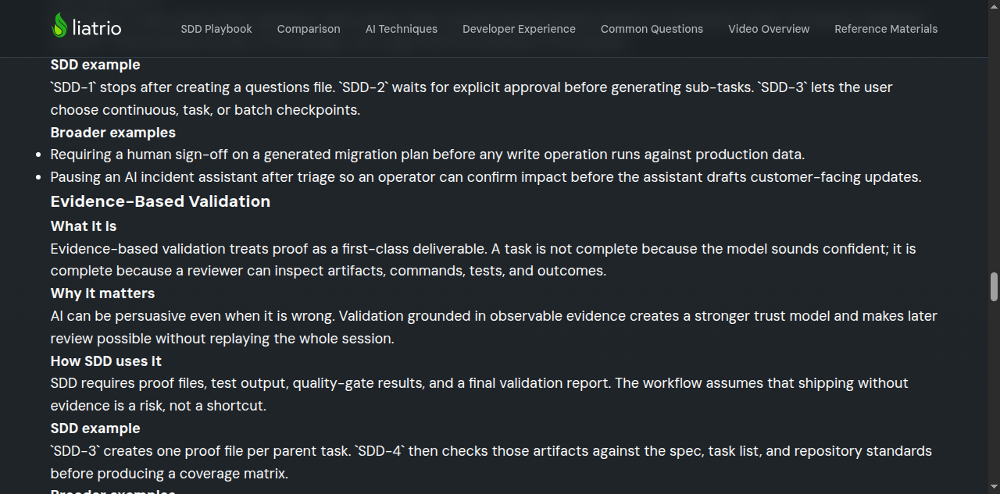

# Task 03 Proofs - Workflow mapping and reusable-practice sections

## Task Summary

This task turns the page from a collection of deep-dive definitions into a guided learning resource. The page now maps
the primitives to `SDD-1` through `SDD-4`, explains what readers can borrow outside full SDD adoption, and connects the
page back to the overview, reference materials, and prompt sources.

## What This Task Proves

- The page explicitly connects the broader primitives to the four SDD prompts.
- The page includes a practical reuse section for readers who want patterns without adopting the whole workflow.
- The page links readers to real SDD artifacts and prompt sources for further study.

## Evidence Summary

- Source checks confirm the workflow-mapping section, reuse section, and supporting links are present.
- One screenshot shows the SDD workflow mapping section in the rendered page.
- A second screenshot shows the reusable-practice section in the rendered page.

## Artifact: Workflow mapping and supporting links in page source

**What it proves:** The page contains the SDD mapping section and the expected cross-links to the overview,
reference materials, and prompt sources.

**Why it matters:** This is what makes the page function as a companion resource rather than an isolated essay.

**Command:**

```bash
python3 - <<'PY'
from pathlib import Path
text = Path('docs/ai-native-development-primitives.html').read_text()
checks = {
    'workflow_mapping_section': 'How These Primitives Power SDD' in text,
    'reuse_section': 'What You Can Reuse Outside Full SDD' in text,
    'overview_link': 'ai-techniques.html' in text,
    'reference_link': 'reference-materials.html' in text,
    'prompts_link': 'tree/main/prompts' in text,
}
for k, v in checks.items():
    print(f'{k}:', v)
PY
```

**Result summary:** All expected sections and links returned `True`, confirming the page now connects the deep dive to
the rest of the SDD learning path.

```text
workflow_mapping_section: True
reuse_section: True
overview_link: True
reference_link: True
prompts_link: True
```

## Artifact: Relevant source lines for mapping and cross-links

**What it proves:** The new workflow-mapping section, reuse section, and supporting links appear in the HTML source at
reviewable locations.

**Why it matters:** This gives a reviewer exact edit targets and confirms the page now includes the required connective
material.

**Command:**

```bash
grep -n "How These Primitives Power SDD\|What You Can Reuse Outside Full SDD\|reference-materials.html\|tree/main/prompts\|ai-techniques.html" "docs/ai-native-development-primitives.html"
```

**Result summary:** The output shows the new workflow and reuse headings alongside multiple links to the overview,
reference materials, and prompts.

```text
32:                    <p>This page is the teaching companion to <a href="ai-techniques.html">AI Techniques Inside SDD</a>.
83:                        <a class="next-step-link next-step-link-primary" href="ai-techniques.html">Return to the
85:                        <a class="next-step-link" href="reference-materials.html">Browse Reference Materials</a>
306:                <h2>How These Primitives Power SDD</h2>
358:                    <p><strong>Want the shorter version?</strong> Start with <a href="ai-techniques.html">AI Techniques
367:                <h2>What You Can Reuse Outside Full SDD</h2>
412:                        <a class="next-step-link next-step-link-primary" href="reference-materials.html">Browse
414:                        <a class="next-step-link" href="ai-techniques.html">Return to the Overview</a>
415:                        <a class="next-step-link" href="https://github.com/liatrio-labs/spec-driven-workflow/tree/main/prompts"
```

## Artifact: Rendered workflow mapping section

**What it proves:** The SDD mapping section renders in the page and is visible to reviewers.

**Why it matters:** This section is the main bridge between the broader primitives framing and the specific SDD
workflow.

**Artifact path:** `docs/specs/01-spec-ai-techniques-deep-dive-page/01-proofs/01-task-03-workflow-map.png`

**Result summary:** The screenshot shows the rendered cards that connect the primitives back to `SDD-1` through
`SDD-4`.



## Artifact: Rendered reusable-practice section

**What it proves:** The page explains how readers can borrow the patterns outside full SDD adoption.

**Why it matters:** The spec explicitly requires the page to stay useful for teams that want the primitives without the
entire workflow.

**Artifact path:** `docs/specs/01-spec-ai-techniques-deep-dive-page/01-proofs/01-task-03-reuse.png`

**Result summary:** The screenshot shows the "What You Can Reuse Outside Full SDD" section and the practical patterns it
calls out for general AI-assisted engineering work.


## Reviewer Conclusion

These artifacts show that the page now does more than define primitives: it ties them back to SDD, explains how to
reuse them elsewhere, and gives readers clear next steps into the rest of the docs and the prompts themselves.
