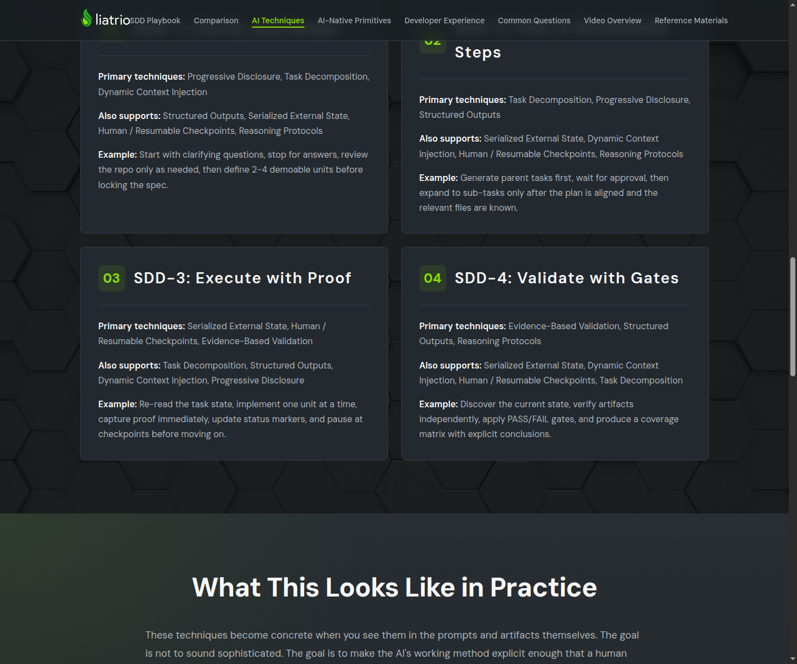
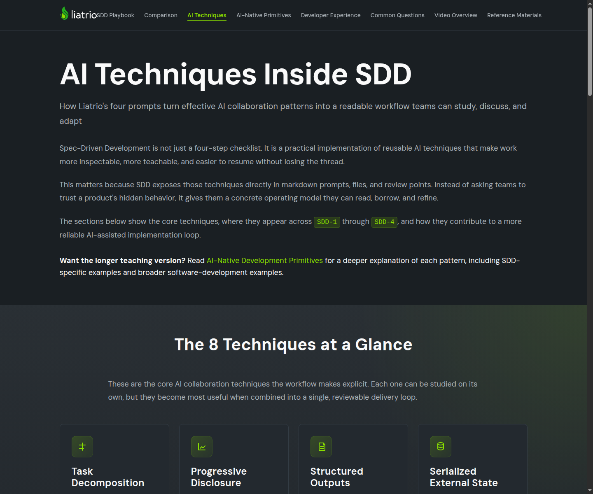

# Task 04 Proofs - Docs integration and visual-system updates

## Task Summary

This task integrates the new page into the docs site instead of leaving it as an orphaned destination. The site now
links to the deep-dive page from navigation, the overview page, and the reference materials page, and shared CSS now
gives the new sections a distinct but consistent visual treatment.

## What This Task Proves

- The deep-dive page is discoverable from the shared navigation.
- Existing docs pages now point readers into the deep-dive page as a companion resource.
- Shared styling supports the new page sections.
- The page remains reviewable in both desktop and narrow-width layouts.

## Evidence Summary

- Source checks show the nav link and cross-page links are present in the expected files.
- Diff stats show the integration touched navigation, shared styles, and the related docs pages.
- Desktop and narrow-width screenshots show the page still renders after the shared-style changes.

## Artifact: Source lines for nav and cross-page integration

**What it proves:** The new page is wired into the broader docs experience.

**Why it matters:** The spec requires the page to be both a top-level destination and a reference companion.

**Command:**

```bash
grep -n "ai-native-development-primitives.html\|AI-Native Primitives" "docs/assets/js/navigation.js" "docs/ai-techniques.html" "docs/reference-materials.html"
```

**Result summary:** The output shows the new navigation entry plus links from the overview and reference pages.

```text
docs/assets/js/navigation.js:20:        { href: basePath + 'ai-native-development-primitives.html', text: 'AI-Native Primitives' },
docs/ai-techniques.html:38:                            href="ai-native-development-primitives.html">AI-Native Development Primitives</a> for a
docs/ai-techniques.html:349:                            href="ai-native-development-primitives.html">Read the Deep Dive</a>
docs/reference-materials.html:37:                            href="ai-native-development-primitives.html">AI-Native Development Primitives</a>, which
docs/reference-materials.html:185:                        <a class="next-step-link" href="ai-native-development-primitives.html">Study the
```

## Artifact: Integration diff footprint

**What it proves:** The task updated the shared integration points rather than only editing the new page in isolation.

**Why it matters:** A discoverable docs feature needs changes in shared navigation, shared CSS, and companion pages.

**Command:**

```bash
git diff --stat HEAD -- "docs/assets/js/navigation.js" "docs/assets/css/styles.css" "docs/ai-techniques.html" "docs/reference-materials.html" "docs/ai-native-development-primitives.html"
```

**Result summary:** The diff stats show the integration touched exactly the shared files expected for navigation,
styling, and cross-page entry points.

```text
 docs/ai-native-development-primitives.html |  6 +--
 docs/ai-techniques.html                    | 15 ++++--
 docs/assets/css/styles.css                 | 75 +++++++++++++++++++++++++++++-
 docs/assets/js/navigation.js               |  1 +
 docs/reference-materials.html              | 11 +++--
 5 files changed, 98 insertions(+), 10 deletions(-)
```

## Artifact: Desktop rendering with integrated navigation

**What it proves:** The page renders as part of the full docs experience on a desktop-sized viewport.

**Why it matters:** The new content and navigation need to feel like part of the site rather than a disconnected page.

**Artifact path:** `docs/specs/01-spec-ai-techniques-deep-dive-page/01-proofs/01-task-04-desktop.png`

**Result summary:** The screenshot shows the rendered page with the integrated navigation and updated section styling on
desktop.


## Artifact: Overview page CTA into the deep dive

**What it proves:** Readers can move from the existing overview page into the new deep-dive companion.

**Why it matters:** This preserves the intended learning path from overview to deeper study.

**Artifact path:** `docs/specs/01-spec-ai-techniques-deep-dive-page/01-proofs/01-task-04-overview-cta.png`

**Result summary:** The screenshot shows the updated overview page CTA with a direct link to the deep-dive page.



## Artifact: Narrow-width layout verification

**What it proves:** The page remains readable at a narrow-width viewport.

**Why it matters:** The task requires verification of the new page's readability in a narrow layout without expanding
scope into a broader mobile-site remediation effort.

**Command:**

```bash
agent-browser open "http://127.0.0.1:8123/ai-native-development-primitives.html" && agent-browser set viewport 390 844 && agent-browser wait --load networkidle && agent-browser eval '({innerWidth: window.innerWidth, innerHeight: window.innerHeight})'
```

**Artifact path:** `docs/specs/01-spec-ai-techniques-deep-dive-page/01-proofs/01-task-04-mobile.png`

**Result summary:** The browser reported a `390x844` viewport, and the screenshot shows the page still renders in a
narrow-width layout.

```json
{
  "innerHeight": 844,
  "innerWidth": 390
}
```



## Reviewer Conclusion

These artifacts show that the deep-dive page is now part of the docs site's navigation and learning flow, uses shared
styling consistent with the rest of the site, and remains reviewable in both desktop and narrow-width layouts.
