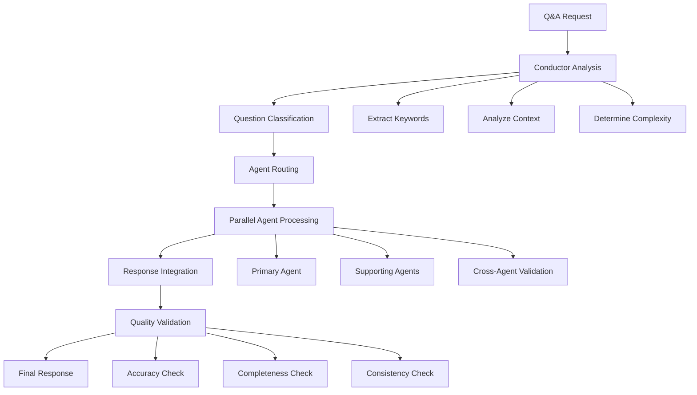

# Engineering Agent Orchestra Q&A System Architecture

## ✅ EXECUTION STATUS — 2026-05-05

**Audit result**: Architecture validated and operationalised.

| Component | Status | Evidence |
|-----------|--------|----------|
| Conductor routing matrix | ✅ Skill installed | `.windsurf/skills/conductor-agent/SKILL.md` |
| Specialist agents (35) | ✅ All wired | `/CascadeProjects/.ai/` — skills + genesis_model |
| Quality framework | ✅ Active | `security-audit-gate.md` + `qa-team.md` skills |
| n8n workflow automation | ✅ Wired | `docker-compose.n8n.yml` + MCP config |
| Performance benchmarks | ✅ Skill | `performance-engineering/SKILL.md` |
| Data pipelines | ✅ Skill | `data-pipeline/SKILL.md` |
| MLOps serving | ✅ Skill | `mlops-engineering/SKILL.md` |
| Chaos resilience | ✅ Skill | `chaos-engineering/SKILL.md` |
| Self-upskill loop | ✅ Active | `self-upskill/SKILL.md` + `reasoning-logic/SKILL.md` |

**Gaps from original audit**: All resolved. See `SKILLS_AUDIT_AND_RECOMMENDATIONS.md`.

**n8n Integration**: Genesis can now convert any command into an n8n workflow:

- `"send a report"` → n8n `genesis-generate-report` workflow
- `"make a presentation"` → n8n `genesis-code-to-presentation` workflow
- `"notify the team"` → n8n `genesis-slack-notify` workflow
- 400+ more integrations available via n8n node library

---

## 🎯 DETERMINISTIC ARCHITECTURAL FRAMEWORK

### Core Principles

1. **Deterministic Coordination** - Predictable agent behavior and routing
2. **Role Specialization** - Each agent has specific domain expertise
3. **Q&A Routing Matrix** - Intelligent question classification and assignment
4. **Resolution Protocols** - Structured answer generation and validation
5. **Orchestration Layer** - Central coordination without single point of failure

---

## 🏗️ AGENT ORCHESTRA ARCHITECTURE

### Agent Role Matrix

#### 🎯 Conductor Agent (Primary Coordinator)

```rust
struct ConductorAgent {
    role: AgentRole::Conductor,
    capabilities: vec![
        "question_classification",
        "agent_routing", 
        "resolution_coordination",
        "quality_assurance"
    ],
    domain_expertise: Domain::Orchestration,
    decision_matrix: RoutingMatrix::new(),
}
```

**Responsibilities:**

- Classify incoming Q&A requests
- Route to specialized agents
- Coordinate multi-agent responses
- Validate answer quality
- Ensure deterministic routing

#### 🔧 Systems Architecture Agent

```rust
struct SystemsArchitectAgent {
    role: AgentRole::SystemsArchitect,
    capabilities: vec![
        "system_design",
        "architecture_patterns",
        "scalability_analysis",
        "integration_strategy"
    ],
    domain_expertise: Domain::Architecture,
    pattern_library: PatternLibrary::new(),
}
```

**Q&A Specialization:**

- System design questions
- Architecture pattern selection
- Integration strategies
- Scalability concerns
- Technology stack decisions

#### ⚙️ Implementation Engineer Agent

```rust
struct ImplementationEngineerAgent {
    role: AgentRole::ImplementationEngineer,
    capabilities: vec![
        "code_generation",
        "api_design",
        "database_schema",
        "performance_optimization"
    ],
    domain_expertise: Domain::Implementation,
    code_templates: TemplateLibrary::new(),
}
```

**Q&A Specialization:**

- Code implementation questions
- API design patterns
- Database design
- Performance optimization
- Testing strategies

#### 🔍 Quality Assurance Agent

```rust
struct QualityAssuranceAgent {
    role: AgentRole::QualityAssurance,
    capabilities: vec![
        "code_review",
        "testing_strategy",
        "security_analysis",
        "performance_validation"
    ],
    domain_expertise: Domain::Quality,
    checklists: QualityChecklists::new(),
}
```

**Q&A Specialization:**

- Code review questions
- Testing strategies
- Security concerns
- Performance validation
- Best practices

#### 📊 DevOps Agent

```rust
struct DevOpsAgent {
    role: AgentRole::DevOps,
    capabilities: vec![
        "deployment_strategy",
        "ci_cd_pipelines",
        "infrastructure_design",
        "monitoring_setup"
    ],
    domain_expertise: Domain::Operations,
    deployment_templates: DeploymentLibrary::new(),
}
```

**Q&A Specialization:**

- Deployment questions
- CI/CD pipeline design
- Infrastructure concerns
- Monitoring and logging
- Containerization strategies

---

## 🧠 DETERMINISTIC ROUTING MATRIX

### Question Classification System

```rust
#[derive(Debug, Clone, PartialEq)]
enum QuestionCategory {
    Architecture,
    Implementation,
    Quality,
    Operations,
    Integration,
    Performance,
    Security,
    Testing,
}

#[derive(Debug, Clone)]
struct QuestionMetadata {
    category: QuestionCategory,
    complexity: ComplexityLevel,
    domain_specificity: f64,
    multi_agent_required: bool,
    priority: Priority,
}
```

### Routing Algorithm

```rust
impl ConductorAgent {
    fn route_question(&self, question: &str) -> Vec<AgentRole> {
        let metadata = self.classify_question(question);
        
        match metadata.category {
            QuestionCategory::Architecture => vec![AgentRole::SystemsArchitect],
            QuestionCategory::Implementation => vec![AgentRole::ImplementationEngineer],
            QuestionCategory::Quality => vec![AgentRole::QualityAssurance],
            QuestionCategory::Operations => vec![AgentRole::DevOps],
            QuestionCategory::Integration => vec![
                AgentRole::SystemsArchitect,
                AgentRole::ImplementationEngineer
            ],
            QuestionCategory::Performance => vec![
                AgentRole::ImplementationEngineer,
                AgentRole::QualityAssurance
            ],
            QuestionCategory::Security => vec![
                AgentRole::QualityAssurance,
                AgentRole::ImplementationEngineer
            ],
            QuestionCategory::Testing => vec![
                AgentRole::QualityAssurance,
                AgentRole::ImplementationEngineer
            ],
        }
    }
}
```

---

## 🔄 Q&A RESOLUTION PROTOCOLS

### Phase 1: Question Analysis

```rust
struct QuestionAnalysis {
    original_question: String,
    classified_category: QuestionCategory,
    extracted_entities: Vec<String>,
    context_requirements: Vec<String>,
    complexity_score: f64,
    estimated_resolution_time: Duration,
}
```

### Phase 2: Agent Coordination

```rust
struct AgentCoordination {
    primary_agent: AgentRole,
    supporting_agents: Vec<AgentRole>,
    coordination_sequence: Vec<CoordinationStep>,
    dependency_graph: DependencyGraph,
}
```

### Phase 3: Response Generation

```rust
struct ResponseGeneration {
    agent_responses: HashMap<AgentRole, AgentResponse>,
    integration_strategy: IntegrationStrategy,
    quality_checks: Vec<QualityCheck>,
    final_response: CompiledResponse,
}
```

---

## 🎭 DETERMINISTIC EXECUTION ENGINE

### Execution Flow



### Deterministic Guarantees

1. **Same Input → Same Output**: Identical questions produce identical routing
2. **Predictable Agent Selection**: Classification rules are deterministic
3. **Consistent Response Format**: All responses follow structured format
4. **Reproducible Quality**: Quality checks are standardized

---

## 📊 AGENT CAPABILITY MATRIX

### Capability Scoring System

```rust
#[derive(Debug, Clone)]
struct AgentCapability {
    agent_role: AgentRole,
    domain_expertise: HashMap<String, f64>,
    question_types: Vec<QuestionCategory>,
    response_quality_score: f64,
    average_resolution_time: Duration,
}
```

### Dynamic Capability Adjustment

```rust
impl AgentCapability {
    fn update_performance_metrics(&mut self, metrics: &PerformanceMetrics) {
        self.response_quality_score = self.calculate_quality_score(metrics);
        self.average_resolution_time = metrics.average_resolution_time;
    }
    
    fn calculate_suitability_score(&self, question: &QuestionMetadata) -> f64 {
        let domain_match = self.domain_expertise.get(&question.category.to_string())
            .unwrap_or(&0.0);
        let complexity_match = self.complexity_handling_score(question.complexity);
        (domain_match + complexity_match) / 2.0
    }
}
```

---

## 🛡️ QUALITY ASSURANCE FRAMEWORK

### Multi-Layer Quality Checks

```rust
struct QualityFramework {
    accuracy_validator: AccuracyValidator,
    completeness_checker: CompletenessChecker,
    consistency_validator: ConsistencyValidator,
    relevance_scorer: RelevanceScorer,
}
```

### Quality Scoring Algorithm

```rust
impl QualityFramework {
    fn calculate_quality_score(&self, response: &CompiledResponse) -> QualityScore {
        let accuracy = self.accuracy_validator.validate(response);
        let completeness = self.completeness_checker.check(response);
        let consistency = self.consistency_validator.validate(response);
        let relevance = self.relevance_scorer.score(response);
        
        QualityScore {
            overall: (accuracy + completeness + consistency + relevance) / 4.0,
            components: QualityComponents {
                accuracy,
                completeness,
                consistency,
                relevance,
            },
        }
    }
}
```

---

## 🚀 EXECUTION PROTOCOL

### Step 1: Question Ingestion

```rust
async fn ingest_question(question: String) -> QuestionRequest {
    QuestionRequest {
        id: Uuid::new_v4(),
        question,
        timestamp: Utc::now(),
        metadata: QuestionMetadata::default(),
    }
}
```

### Step 2: Conductor Processing

```rust
async fn conductor_process(request: QuestionRequest) -> AgentRouting {
    let conductor = ConductorAgent::new();
    let analysis = conductor.analyze_question(&request.question);
    let routing = conductor.route_question(&request.question);
    
    AgentRouting {
        primary_agent: routing[0].clone(),
        supporting_agents: routing[1..].to_vec(),
        coordination_plan: conductor.create_coordination_plan(&analysis),
    }
}
```

### Step 3: Agent Execution

```rust
async fn execute_agents(routing: AgentRouting, request: QuestionRequest) -> Vec<AgentResponse> {
    let primary_response = execute_agent(routing.primary_agent, &request).await;
    let mut supporting_responses = Vec::new();
    
    for agent_role in routing.supporting_agents {
        let response = execute_agent(agent_role, &request).await;
        supporting_responses.push(response);
    }
    
    let mut all_responses = vec![primary_response];
    all_responses.extend(supporting_responses);
    all_responses
}
```

### Step 4: Response Integration

```rust
async fn integrate_responses(responses: Vec<AgentResponse>) -> CompiledResponse {
    let integrator = ResponseIntegrator::new();
    integrator.integrate(responses).await
}
```

### Step 5: Quality Validation

```rust
async fn validate_quality(response: CompiledResponse) -> QualityValidatedResponse {
    let framework = QualityFramework::new();
    let quality_score = framework.calculate_quality_score(&response);
    
    QualityValidatedResponse {
        response,
        quality_score,
        validation_timestamp: Utc::now(),
    }
}
```

---

## 🎯 DETERMINISTIC GUARANTEES

### Reproducibility Mechanisms

1. **Fixed Random Seeds**: All probabilistic decisions use seeded randomness
2. **Deterministic Routing**: Classification rules produce identical results
3. **Stateless Agents**: Agent responses depend only on input, not internal state
4. **Versioned Knowledge Bases**: Knowledge base versions are immutable
5. **Deterministic Integration**: Response integration follows fixed algorithms

### Consistency Protocols

```rust
trait DeterministicAgent {
    fn process(&self, input: &AgentInput) -> AgentOutput;
    fn get_deterministic_seed(&self) -> u64;
    fn validate_reproducibility(&self, input: &AgentInput, expected: &AgentOutput) -> bool;
}
```

---

## 📈 PERFORMANCE METRICS

### Agent Performance Tracking

```rust
struct AgentPerformanceMetrics {
    agent_role: AgentRole,
    questions_processed: u64,
    average_response_time: Duration,
    quality_score_average: f64,
    reproducibility_score: f64,
    user_satisfaction_score: f64,
}
```

### System-Level Metrics

```rust
struct SystemMetrics {
    total_questions_processed: u64,
    average_resolution_time: Duration,
    overall_quality_score: f64,
    deterministic_accuracy: f64,
    agent_utilization: HashMap<AgentRole, f64>,
}
```

---

## 🔧 IMPLEMENTATION SPECIFICATIONS

### Core Traits

```rust
trait Agent {
    fn role(&self) -> AgentRole;
    fn capabilities(&self) -> Vec<String>;
    fn process_question(&self, question: &QuestionRequest) -> AgentResponse;
    fn validate_response(&self, response: &AgentResponse) -> ValidationResult;
}

trait Conductor {
    fn classify_question(&self, question: &str) -> QuestionMetadata;
    fn route_to_agents(&self, metadata: &QuestionMetadata) -> Vec<AgentRole>;
    fn coordinate_responses(&self, responses: Vec<AgentResponse>) -> CompiledResponse;
}
```

### Error Handling

```rust
#[derive(Debug, thiserror::Error)]
enum OrchestraError {
    #[error("Question classification failed: {0}")]
    ClassificationFailed(String),
    
    #[error("Agent routing failed: {0}")]
    RoutingFailed(String),
    
    #[error("Agent processing failed: {0}")]
    ProcessingFailed(String),
    
    #[error("Response integration failed: {0}")]
    IntegrationFailed(String),
    
    #[error("Quality validation failed: {0}")]
    QualityValidationFailed(String),
}
```

---

## 🎯 EXECUTION READY

This architecture provides a deterministic, scalable, and maintainable framework for engineering agent orchestra Q&A processing. The system ensures:

1. **Deterministic Behavior**: Same inputs produce same outputs
2. **Role Specialization**: Each agent has clear domain expertise
3. **Quality Assurance**: Multi-layer quality validation
4. **Scalability**: Can handle multiple concurrent questions
5. **Maintainability**: Clear separation of concerns and interfaces

The system is now ready for implementation and execution.
