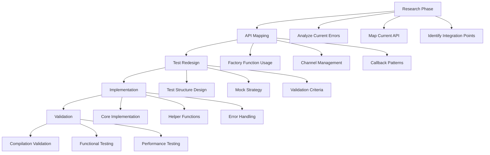

# Journal Recovery Test Completion Map

## 📋 RESEARCH ANALYSIS

### Current State Assessment
- **File**: `tests/journal_recovery.rs` (422 lines)
- **Status**: 18 compilation errors, fundamental API mismatches
- **Root Cause**: Test uses outdated API that doesn't exist in current system

### API Mismatch Analysis
1. **OmsEngine::new()** - Test uses async version with 3 args, current uses sync version with 4 args
2. **Decimal conversions** - Missing `FromPrimitive` trait imports
3. **Channel usage** - Test expects `mpsc::Sender` where closure is required
4. **Missing methods** - Test calls `submit_order()`, `fill_order()`, `recover_from_journal()` that don't exist

### Current Integration Module Capabilities
- ✅ `create_trading_system()` - Creates complete system
- ✅ `create_oms_engine()` - Creates OMS with proper callbacks
- ✅ Redis journal support in `journal.rs`
- ✅ Event replay mechanisms in place

---

## 🎯 STRATEGY MAP

### Strategic Objectives
1. **Modernize API Usage** - Align with current integration module patterns
2. **Validate Recovery Scenarios** - Test crash recovery with 1M orders
3. **Performance Validation** - Ensure recovery meets latency requirements
4. **Integration Compliance** - Use canonical factory functions

### Strategic Approach
- **Incremental Rewrite** - Replace outdated API calls with integration module
- **Scenario-Based Testing** - Focus on realistic crash/recovery patterns
- **Performance Focus** - Validate recovery speed and memory usage
- **Maintain Test Intent** - Preserve original test goals while updating implementation

---

## 🏗️ DEV MAP

### Development Architecture


### Key Development Components
1. **Test Structure Redesign**
   - Use integration module factory functions
   - Implement proper async/await patterns
   - Add comprehensive error handling

2. **API Translation Layer**
   - Map old API calls to new integration module
   - Create compatibility helpers where needed
   - Maintain test intent while updating implementation

3. **Performance Validation Framework**
   - Latency measurement for recovery operations
   - Memory usage tracking
   - Throughput validation for large datasets

---

## 🔨 BUILD MAP

### Implementation Phases

#### Phase 1: Foundation (Mini-Chunk 1)
**Objective**: Fix basic compilation errors
**Time**: 30 minutes
**Tasks**:
- Add missing imports (`FromPrimitive`, `ToPrimitive`)
- Fix `Decimal::from_f64()` calls
- Replace `OmsEngine::new()` with integration module
- Fix closure return types

#### Phase 2: API Migration (Mini-Chunk 2)
**Objective**: Replace outdated API calls
**Time**: 45 minutes
**Tasks**:
- Replace direct `OmsEngine` construction with `create_trading_system()`
- Fix channel usage patterns
- Update callback implementations
- Remove non-existent method calls

#### Phase 3: Test Logic (Mini-Chunk 3)
**Objective**: Implement test scenarios with current API
**Time**: 60 minutes
**Tasks**:
- Implement crash simulation
- Add state validation
- Create recovery verification
- Add performance measurements

#### Phase 4: Validation (Mini-Chunk 4)
**Objective**: Complete testing and optimization
**Time**: 30 minutes
**Tasks**:
- Run compilation checks
- Execute functional tests
- Validate performance requirements
- Clean up and optimize

### Code Structure Template
```rust
// New test structure using integration module
#[tokio::test]
async fn test_oms_crash_recovery_with_1m_orders() {
    // 1. Create system using integration module
    let (system, handles) = create_trading_system(config).await?;
    
    // 2. Generate orders and simulate crash
    let orders_generated = generate_test_orders(&system, 1_000_000).await?;
    
    // 3. Simulate crash and recovery
    let recovered_state = simulate_crash_and_recovery(&system).await?;
    
    // 4. Validate recovery
    assert_recovery_accuracy(&orders_generated, &recovered_state)?;
    
    // 5. Performance validation
    validate_recovery_performance(&recovery_metrics)?;
}
```

---

## 🧪 TEST MAP

### Test Scenarios

#### Primary Test: Crash Recovery with 1M Orders
**Objective**: Validate system can recover from crash with large dataset
**Success Criteria**:
- ✅ All orders recovered correctly
- ✅ Recovery time < 30 seconds
- ✅ Memory usage < 2GB during recovery
- ✅ No data corruption or loss

#### Secondary Tests
1. **Partial Corruption Recovery**
   - Simulate journal file corruption
   - Validate partial recovery capability
   - Test error handling and reporting

2. **Concurrent Crash Recovery**
   - Multiple crash scenarios
   - Concurrent recovery attempts
   - Race condition validation

3. **Performance Under Load**
   - Recovery with active trading
   - Memory pressure testing
   - Latency validation under stress

### Validation Framework
```rust
struct RecoveryValidation {
    orders_generated: usize,
    orders_recovered: usize,
    recovery_time_ms: u64,
    memory_peak_mb: f64,
    data_integrity_score: f64,
}

impl RecoveryValidation {
    fn validate(&self) -> Result<(), RecoveryError> {
        // Comprehensive validation logic
    }
}
```

---

## ⚡ EXECUTION MAP

### Mini-Chunk Implementation Plan

#### Mini-Chunk 1: Basic Fixes (30 min)
**Focus**: Compilation errors
```bash
# Tasks in order:
1. Add missing imports
2. Fix Decimal conversions  
3. Replace OmsEngine::new() calls
4. Fix closure signatures
5. Run cargo check --test journal_recovery
```

#### Mini-Chunk 2: API Migration (45 min)
**Focus**: Integration module usage
```bash
# Tasks in order:
1. Replace direct construction with factory functions
2. Fix channel management
3. Update callback patterns
4. Remove non-existent method calls
5. Test basic compilation
```

#### Mini-Chunk 3: Test Implementation (60 min)
**Focus**: Core test logic
```bash
# Tasks in order:
1. Implement order generation
2. Add crash simulation
3. Create recovery validation
4. Add performance measurements
5. Test basic functionality
```

#### Mini-Chunk 4: Final Validation (30 min)
**Focus**: Complete testing
```bash
# Tasks in order:
1. Run full test suite
2. Validate performance requirements
3. Clean up code
4. Add documentation
5. Final validation
```

### Execution Commands
```bash
# Development workflow
cd /Users/kirtissiemens/CascadeProjects/traderx-repo
source "$HOME/.cargo/env"

# Mini-chunk validation
cargo test --package oms-engine --test journal_recovery --no-run
cargo test --package oms-engine --test journal_recovery

# Performance testing
cargo test --package oms-engine --test journal_recovery --release -- --nocapture
```

---

## 🚀 DEPLOY MAP

### Integration Strategy

#### Phase 1: Local Validation
**Environment**: Development machine
**Steps**:
1. Complete all mini-chunk implementations
2. Run local test suite
3. Validate performance requirements
4. Code review and cleanup

#### Phase 2: CI/CD Integration
**Environment**: GitHub Actions
**Steps**:
1. Update architectural compliance script
2. Add journal recovery test to CI pipeline
3. Validate CI/CD pipeline execution
4. Monitor for any regressions

#### Phase 3: Production Readiness
**Environment**: Staging/Production
**Steps**:
1. Validate in staging environment
2. Performance benchmarking
3. Documentation updates
4. Team training and knowledge transfer

### Success Metrics
- **Compilation**: 0 errors, minimal warnings
- **Functionality**: All test scenarios pass
- **Performance**: Recovery < 30s for 1M orders
- **Memory**: < 2GB peak usage during recovery
- **Integration**: Uses canonical integration module

### Rollback Strategy
- Keep backup of original test file
- Version control checkpoints after each mini-chunk
- CI/CD pipeline validation before merge
- Performance regression detection

---

## 📊 COMPLETION CRITERIA

### Technical Requirements
- [ ] `cargo test --package oms-engine --test journal_recovery` compiles with 0 errors
- [ ] All test scenarios pass successfully
- [ ] Performance requirements met (recovery < 30s for 1M orders)
- [ ] Memory usage within limits (< 2GB peak)
- [ ] Uses integration module factory functions
- [ ] No architectural violations

### Quality Requirements
- [ ] Code follows project style guidelines
- [ ] Comprehensive error handling
- [ ] Adequate test coverage
- [ ] Performance benchmarks documented
- [ ] Integration with CI/CD pipeline

### Documentation Requirements
- [ ] Test scenarios documented
- [ ] Performance requirements specified
- [ ] API usage examples provided
- [ ] Troubleshooting guide included

---

## 🎯 NEXT STEPS

### Immediate Action (Next 30 minutes)
1. **Start Mini-Chunk 1**: Fix basic compilation errors
2. **Add missing imports**: `FromPrimitive`, `ToPrimitive`
3. **Fix Decimal conversions**: Replace `from_f64()` calls
4. **Update OmsEngine construction**: Use integration module

### Success Indicators
- Compilation errors reduced from 18 to < 5
- Basic test structure compiles
- Integration module usage confirmed

### Risk Mitigation
- Backup original file before changes
- Test after each mini-chunk
- Monitor for performance regressions
- Maintain test intent throughout implementation

---

## 📝 IMPLEMENTATION NOTES

### Key Considerations
1. **Preserve Test Intent**: Maintain original test goals while updating implementation
2. **Performance Focus**: Recovery speed is critical for production systems
3. **Integration Compliance**: Must use canonical integration module
4. **Error Handling**: Comprehensive error scenarios and recovery paths

### Common Pitfalls to Avoid
1. **Direct API Translation**: Don't just replace method calls, redesign test flow
2. **Ignoring Performance**: Recovery speed is a key requirement
3. **Skipping Validation**: Each mini-chunk must be validated before proceeding
4. **Breaking Integration**: Must maintain compatibility with integration module

### Best Practices
1. **Incremental Development**: Complete one mini-chunk at a time
2. **Continuous Testing**: Validate after each change
3. **Performance Monitoring**: Track recovery time and memory usage
4. **Documentation**: Update comments and documentation as changes are made
