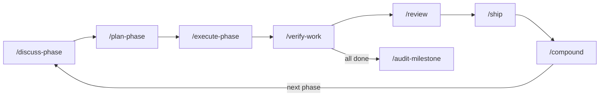

# Compounding & Quality

These 7 workflows close the loop between building and learning. They turn solved problems into searchable knowledge, enforce multi-persona review, stress-test scope before committing, and ship code through a structured pipeline.


**New in v2.0.0.**

---

## `/compound`

Captures a recently solved problem or learned pattern while context is fresh.

```bash
/compound                   # full mode: research, overlap detection, dedup
/compound --lightweight     # single-pass, fewer tokens
```

**What it does:**

1. Asks you to choose **Full** or **Lightweight** mode
2. Classifies the solution by track (**bug** or **knowledge**) and category
3. Researches `.planning/solutions/` for overlapping prior art
4. Writes a structured document with YAML frontmatter to `.planning/solutions/[category]/`
5. Commits and offers `@agentic-learning space` to schedule review

**Output:** `.planning/solutions/[category]/[filename].md` — searchable by `/plan-phase` (Step 2b) and `/knowledge-base`.

**When to use:**

- After `/debug` resolves a bug — capture the problem, root cause, and fix
- After `/verify-work` passes — capture notable patterns from the phase
- After any "aha moment" in a session — compound it before context fades

**Agent:** `solution-writer` (inline persona or `learnship-solution-writer` subagent).

**Learning checkpoint:** `either-or` · `reflect`

---

## `/review`

Multi-persona code review through six lenses.

```bash
/review                     # interactive mode (default)
/review --report            # report-only, no conversation
/review --autofix           # apply fixes automatically
```

**The 6 review lenses:**

| Lens | What it checks |
|------|---------------|
| **Correctness** | Logic errors, edge cases, off-by-one, null handling |
| **Testing** | Coverage gaps, missing assertions, test quality |
| **Security** | Input validation, auth, secrets, injection vectors |
| **Performance** | N+1 queries, unnecessary re-renders, memory leaks |
| **Maintainability** | Naming, coupling, dead code, abstraction quality |
| **Adversarial** | What would a hostile user or a 3am oncall do with this? |

**Output:** Severity-ranked findings (P0–P3) with confidence scores (0.0–1.0). Only lenses relevant to the diff are activated (e.g., no security lens for a CSS-only change).

**Agent:** `code-reviewer` (inline persona or `learnship-code-reviewer` subagent).

**Config:** `review.auto_after_verify` — when `true`, automatically runs after `/verify-work` passes.

**Learning checkpoint:** `learn` · `either-or`

---

## `/challenge`

Product and engineering challenge gate — is this worth building?

```bash
/challenge "[proposal description]"
/challenge                  # reads from MILESTONE-CONTEXT.md or ROADMAP.md
```

**What it does:**

1. Gathers context from PROJECT.md, ROADMAP.md, DECISIONS.md
2. Applies two lenses in parallel (or sequentially):
   - **Product lens:** Does this solve a real user problem? Is the scope right?
   - **Engineering lens:** Is this the simplest architecture? What are we coupling to?
3. Asks 3–5 forcing questions per lens
4. Synthesizes a verdict: **proceed**, **rethink**, or **reduce scope**
5. Records the decision to `DECISIONS.md`

**When to use:** Before committing to a milestone, large feature, or major refactor. 15 minutes of challenge prevents weeks of rework.

**Agent:** `challenger` (inline persona or `learnship-challenger` subagent).

**Learning checkpoint:** `either-or` · `brainstorm`

---

## `/ship`

End-to-end ship pipeline: test → lint → commit → push → PR.

```bash
/ship                       # full pipeline
/ship --skip-tests          # skip test step
/ship --dry-run             # show what would happen without executing
```

**What it does:**

1. **Pre-flight:** Detects test runner, linter, git status
2. **Test:** Runs detected test suite (skip with `--skip-tests` or `ship.auto_test: false`)
3. **Lint:** Runs detected linter if present
4. **Stage:** `git add` changed files
5. **Commit:** Conventional commit format (`feat:`, `fix:`, `chore:`, etc.) when `ship.conventional_commits: true`
6. **Push:** `git push` to current branch
7. **PR:** Creates pull request with auto-generated description when `ship.pr_template: true`
8. **Confirm:** Shows summary and suggests `/compound` for notable patterns

**Config options:**

| Key | Default | What it controls |
|-----|---------|-----------------|
| `ship.auto_test` | `true` | Run tests before shipping |
| `ship.conventional_commits` | `true` | Use conventional commit format |
| `ship.pr_template` | `true` | Auto-generate PR description |

**Learning checkpoint:** `reflect`

---

## `/ideate`

Codebase-grounded divergent ideation — discover what's worth building next.

```bash
/ideate                     # scan codebase and generate ideas
/ideate "[focus area]"      # scope to a specific area
```

**What it does:**

1. Scans codebase for TODOs, test gaps, hotspots, and friction points
2. Generates 15–25 ideas across four thinking frames:
   - **User pain:** What frustrates users right now?
   - **Inversion:** What if we did the opposite of the current approach?
   - **Assumption-breaking:** What are we assuming that might be wrong?
   - **Leverage:** Where would a small change have outsized impact?
3. Deduplicates and adversarial-filters weak ideas
4. Presents top 5–7 ranked survivors with effort estimates

**When to use:** Between milestones (after `/complete-milestone`, before `/discuss-milestone`), or when you feel stuck on what to build next. Requires an existing project — for pre-project ideation, use `@agentic-learning brainstorm [idea]` instead.

**Agent:** `ideation-agent` (inline persona or `learnship-ideation-agent` subagent).

**Learning checkpoint:** `brainstorm` · `either-or`

---

## `/guard`

Safety mode for sensitive phases — warns before destructive commands and locks file scope.

```bash
/guard auth/ payments/ config/    # protect these directories
/guard --off                       # deactivate safety mode
```

**What it does:**

1. Determines scope from arguments or asks interactively
2. Creates `.planning/guard-state.md` with protected paths and rules
3. **While active:**
   - Warns before any destructive command (`rm`, `DROP`, `truncate`, etc.)
   - Warns before editing files outside the guarded scope
   - Adds a `🛡️ GUARD` prefix to the session banner
4. Persists across sessions via `guard-state.md`
5. Deactivate with `/guard --off`

**When to use:** Working on auth, payments, database migrations, or any area where accidental changes could be catastrophic.

**Learning checkpoint:** `learn`

---

## `/sync-docs`

Detects stale documentation after code changes.

```bash
/sync-docs                  # scan for drift
/sync-docs --autofix        # fix simple cases automatically
```

**What it does:**

1. Identifies documentation files (README, docs/, API docs, inline JSDoc/docstrings)
2. Compares against recent git changes
3. Scans for: renamed references, outdated paths, stale examples, broken links
4. Reports findings by severity (high/medium/low)
5. Auto-fixes simple cases with `--autofix` (renamed references, updated paths)

**When to use:** Before `/complete-milestone` (it's suggested automatically), after large refactors, or periodically during long milestones.

**Learning checkpoint:** `learn`

---

## The extended phase loop

v2.0 extends the phase loop with three new steps after verification:



```bash
# Full v2.0 phase lifecycle
/discuss-phase N
/plan-phase N
/execute-phase N
/verify-work N
/review              # multi-persona code review
/ship                # test → lint → commit → push → PR
/compound            # capture what you learned
/discuss-phase N+1   # next phase
```

The last three steps are recommended after every phase. They surface naturally through done-banner suggestions after `/verify-work` passes.

---

## New agent personas

v2.0 adds 4 new agent personas, each available as both inline (sequential) and dispatch (parallel subagent):

| Agent | Role | Sandbox mode (Codex) |
|-------|------|---------------------|
| `solution-writer` | Writes structured solution documents | workspace-write |
| `code-reviewer` | Reviews code through persona-specific lenses | read-only |
| `challenger` | Stress-tests proposals through forcing questions | read-only |
| `ideation-agent` | Generates codebase-grounded improvement ideas | read-only |
